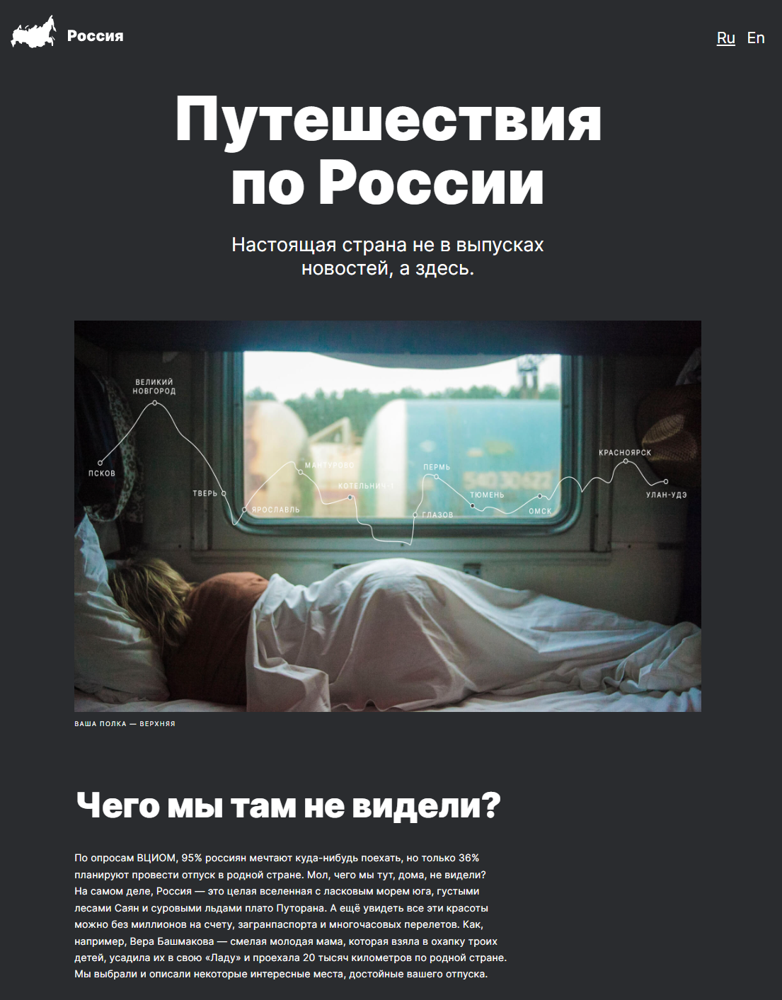

# Путешествие по России

#### Ссылка на сайт: https://balzak1976.github.io/russian-travel

## Описание и функциональность проекта

1. В проекте используются технологии:

- флекс-бокс
- Grid Layout
- методология БЭМ (наименование классов и файловая структура CSS - Nested БЭМ)

2. Сайт адаптирован для устройств с шириной экрана от 320px

<div align="center">

### Главная страница

</div>



## Стэк технологий

| <a href="https://html.spec.whatwg.org/multipage/" target="_blank" rel="noreferrer"></a> | <a href="https://www.w3schools.com/css/" target="_blank" rel="noreferrer"></a> | <a href="http://getbem.com/" target="_blank"></a> |
| :---: | :---: | :---: |
| HTML | CSS  | BEM |

<br>


## Запуск проекта

клонировать репозиторий

```javascript
git clone https://github.com/Balzak1976/russian-travel.git
```
запустить index.html

<br>

[**Ссылка на макет в Figma**](https://www.figma.com/file/5S2WSbEFL6awjVWJ0NWL8Q/Sprint-3_-Russia-_-desktop-mobile?node-id=28503%3A0))

[**Сайт выполнен на курсе Яндекс Практикум**](https://practicum.yandex.ru/profile/web/)
